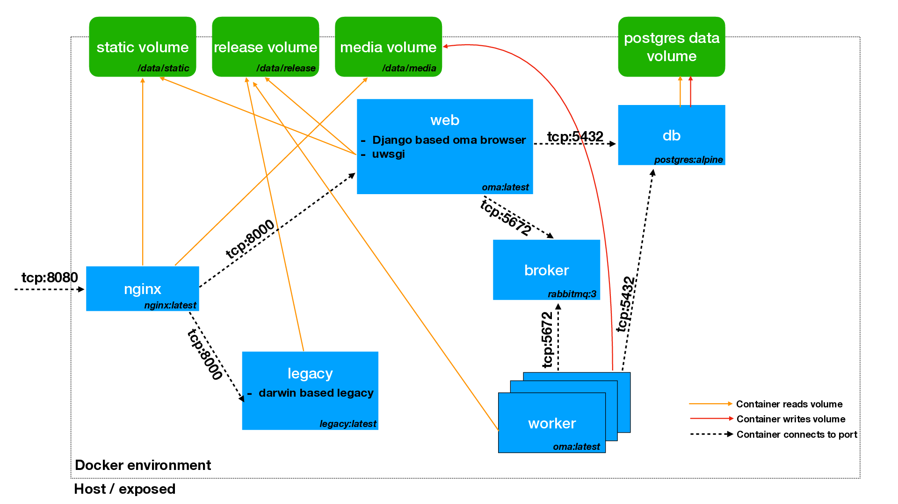

# Running OMA Browser with docker-compose

### TL;DR

- adjust settings in `env` (OMA_INSTANCE, ...)
- adjust settings in `docker-compose.yml`:
  
  - bind mount release data?
  - bind mount current checkout?
  
- `build_container` to build containers for OMA browser
- `docker-compose up` to start containers


### Background

The OMA Browser can be run via docker-compose as orchestration 
tool for near production, testing and development purposes.

Currently the setup has not yet been tested under heavy load, 
but it seems to work quite smoothly on various sized datasets.

The following figure should give you a brief overview of the containers 
and volumes and how they interact:
 
 

In our setup of the containers, we make use of the 
DOCKER_BUILDKIT extension, especially the `--ssh default` feature 
to access the lab's git repo server. Currently (May 2020) this feature is 
not yet supported by docker-compose directly. Because of this, the 
docker images have to be converted with an extra script named `build_container`.

### Settings in `env` file

The `env` file contains most settings relevant to build and run the 
containers. The paths variables in the beginning are the mount points 
_inside_ the containers and can in most situations be left as they 
are defined. 

The values for `OMA_INSTANCE`, and `PRODUCTION_TYPE` can be modified
as needed. The OMA_INSTANCE has the main thing to change between
different setups/instances with different features. They load different
django settings.

The settings for PYOMABROWSER_CODEBASE and PYOMABROWSER_GITTAG variables 
should be adapted depending on whether from the current source checkout 
or directly from the git-repo at a certain tag should be used to build 
the oma docker image.

### Settings in `docker-compose.yml`

In the docker-compose file, you should mainly edit the mount method of 
the omabrowser data. By default it assumes a 
[docker volume](https://docs.docker.com/storage/volumes/), but also 
a **bind mount** of a host directory into the container is possible (but 
discouraged for production).

Last but not least, by uncommenting the line 

`..:/usr/src/pyomabrowser`

in the web and celery service:volume section, you can mount the current 
repo checkout from your host to the docker containers which allows
to transparently refresh on code changes. Note however that if 
static files change, you have to restart the docker-compose instances.

### Building the images

To build the images you should only need to run 
`build_container` from the for_docker/ directory on your host.
Note that this is a simple python script that requires yaml to 
be installed. You might need to install it into a virtualenv or 
install it systemwide with `pip install pyaml`.

### Starting services
You should then be able to start the services with 
`docker-compose up`. This will run things in the foreground and 
you can check the logs of the different services. The first time 
you do this using a docker volume for the oma browser data, you
will see error messages the the database cannot be opened. This 
means you haven't yet copied the data into the volume. 
(See next point)
You can also start the containers in the background with `docker-compose up -d` 
and stop them with `docker-compose down`. 

### Copying data into the release_volume
In order to copy the data of a specific release into a 
docker release_volume, you need to mount both, the 
original data and the release_volume into a thin docker 
container and copy the data in there:

```shell script
docker run --rm -ti --volume release_volume:/data -v /path/on/host/to/release:/input oma:latest cp -rpn /input/ /data
```

This command would use the oma container to copy the data from /path/on/host/to/relase into the volume. Note that the 
path should be the directory that contains the `data`, and `downloads` directory of the release you need.

### Removing volumes
When changing a release you should consider removing **all the volume data**, i.e.
the postgres sql data, the media folder and probably also the release data.
You can do that with 
```shell script
docker-compose down --volume
```
